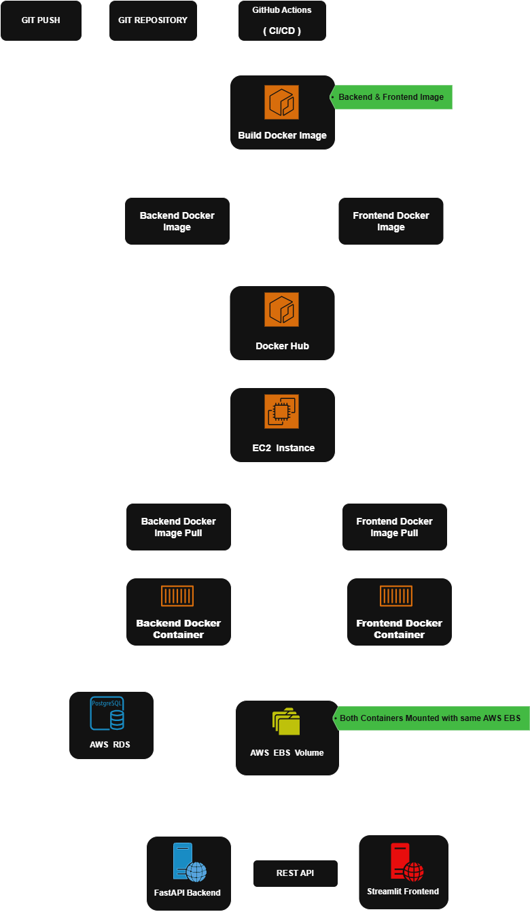

# Deployment Architecture

## Overview

DriftShield follows an automated CI/CD deployment pipeline powered by GitHub Actions and Docker. Every code change pushed to the GitHub repository automatically triggers the deployment workflow, where separate Docker images are built for the FastAPI backend and Streamlit frontend before being published to Docker Hub.

Both containers are deployed on a single AWS EC2 instance. The backend container is responsible for serving prediction, drift detection, and model management APIs, while the frontend container provides the interactive Streamlit user interface and communicates with the backend through REST APIs.

To ensure data persistence across deployments, both containers share a mounted AWS EBS volume that stores model artifacts, reference datasets, drift reports, metrics, and application logs. The backend also connects to an AWS RDS PostgreSQL database for storing production prediction logs and model registry metadata.

This deployment architecture enables automated application updates, persistent storage, centralized model management, and reliable communication between the frontend and backend services.

---

## Deployment Workflow

1. Developer pushes the latest code to the GitHub repository.
2. GitHub Actions automatically builds Docker images for both backend and frontend services.
3. The generated images are published to Docker Hub.
4. The AWS EC2 instance pulls the latest container images.
5. Backend and frontend containers start using the shared AWS EBS volume.
6. The backend connects to AWS RDS for application data, while the frontend communicates with the backend through REST APIs.