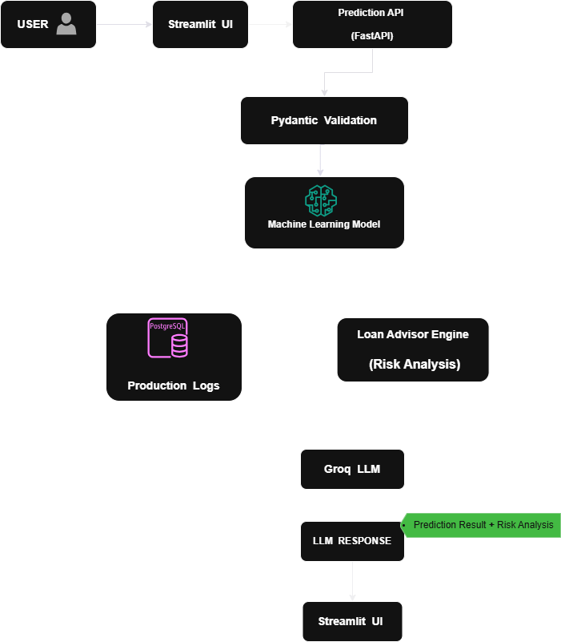

## Phase 1 - Loan Default Prediction Workflow

### Overview

The prediction workflow serves as the primary entry point of DriftShield. Users submit loan application details through a Streamlit-based interface, which communicates with a FastAPI backend for processing.

The backend validates incoming data using Pydantic schemas before passing it to an XGBoost machine learning model for inference. Once the prediction is generated, the system stores both the input features and prediction results in PostgreSQL. These records later act as production data for drift detection and monitoring.

In parallel, the prediction output is sent to the Loan Advisor Engine, where risk factors and positive factors are analyzed and provided to a Groq-powered Large Language Model (LLM). The LLM generates human-readable loan recommendations and explanations that help users better understand the prediction outcome.

Finally, the backend combines the prediction result and AI-generated recommendation into a single API response and returns it to the frontend for display.

### Workflow

1.  User submits loan application data through the Streamlit interface.
    
2.  FastAPI receives the request and validates the payload using Pydantic schemas.
    
3.  The validated data is passed to the XGBoost model for inference.
    
4.  The model returns the predicted default status and probability score.
    
5.  Input features, prediction results, and timestamps are stored in PostgreSQL as prediction logs.
    
6.  The Loan Advisor Engine analyzes risk indicators and prepares context for the LLM.
    
7.  Groq LLM generates personalized loan recommendations and explanations.
    
8.  The backend combines prediction outputs and AI insights into a JSON response.
    
9.  The Streamlit frontend displays the final prediction result and AI-generated recommendation to the user.

---

