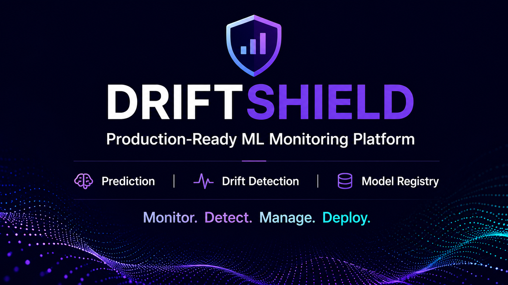
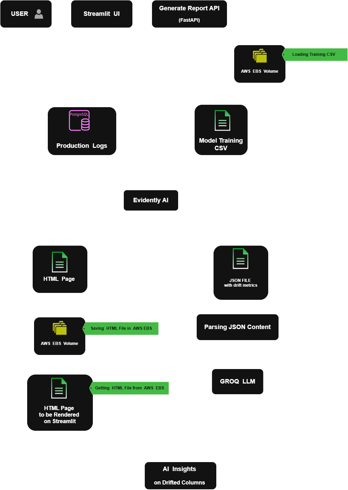
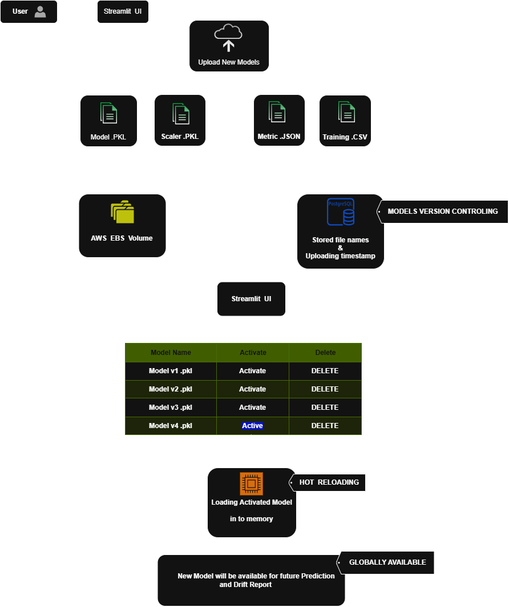

---
       
---
## Project Overview

Machine learning models often achieve excellent performance during development and testing. However, once deployed into production, their reliability can gradually decline as real-world data evolves over time. This phenomenon, commonly known as **data drift**, is one of the biggest challenges in maintaining accurate and trustworthy machine learning systems.

While many machine learning projects successfully demonstrate model training and prediction, very few focus on what happens after deployment. In real-world production environments, organizations must continuously monitor incoming data, detect distribution shifts, understand why model performance is changing, and deploy improved model versions without disrupting existing services.

**DriftShield** was built to address these challenges by simulating the complete production lifecycle of a deployed machine learning system. Instead of focusing solely on inference, the platform combines intelligent prediction, continuous production monitoring, automated drift detection, AI-assisted analysis, and dynamic model version management into a single end-to-end workflow.

The project uses an **XGBoost-based Loan Default Prediction Model** as a real-world use case. Every prediction generated by the application is stored as production data, allowing the system to compare live prediction data against the original training dataset using **Evidently AI**. When drift is detected, the platform automatically generates interactive drift reports, extracts statistical metrics, and leverages a Large Language Model (LLM) to produce human-readable insights that explain how the production data has changed.

To support continuous model improvement, DriftShield also includes a centralized **Model Registry**, enabling administrators to upload, manage, and activate new model versions without modifying application code or redeploying the entire system. This demonstrates how modern machine learning applications can safely evolve while remaining available in production.

Built with **FastAPI**, **Streamlit**, **PostgreSQL**, **Docker**, **GitHub Actions**, **AWS EC2**, **AWS EBS**, **AWS RDS**, and **Groq LLM**, DriftShield demonstrates how multiple technologies work together to create a production-oriented machine learning monitoring platform that extends far beyond traditional prediction-based projects.
## Key Features

- **Real-Time Loan Default Prediction** using an XGBoost classification model.
- **AI-Powered Loan Advisor** that generates personalized loan recommendations and risk explanations using a Large Language Model (LLM).
- **Production Prediction Logging** to continuously collect real-world inference data for monitoring.
- **Automated Data Drift Detection** using **Evidently AI** by comparing production data with the original training reference dataset.
- **Interactive Drift Reports** with visual feature-level drift analysis and statistical comparisons.
- **AI-Powered Drift Analysis** that transforms raw drift metrics into human-readable insights and recommendations.
- **Centralized Model Registry** for managing model versions and deployment artifacts.
- **Dynamic Model Switching** without modifying application code or redeploying the application.
- **Persistent Artifact Storage** using AWS EBS for models, datasets, reports, metrics, and logs.
- **Containerized Deployment Pipeline** powered by Docker and GitHub Actions CI/CD for automated deployment.

---

# Machine Learning Pipeline

This section documents the complete machine learning workflow behind DriftShield, including dataset preparation, feature engineering, model training, evaluation, prediction generation, and production inference.

> **Note:** This section is intentionally reserved and will be documented separately to provide a detailed explanation of the machine learning pipeline, design decisions, and implementation methodology.

---
# System Architecture

DriftShield is designed as a production-oriented machine learning platform that extends beyond traditional prediction systems. Instead of focusing solely on model inference, the application is organized into three independent architectural phases that together represent the complete lifecycle of a deployed machine learning model.

Each phase addresses a specific production challenge, beginning with real-time prediction, followed by continuous data drift monitoring, and finally enabling dynamic model version management and deployment. Together, these components provide an end-to-end workflow for serving, monitoring, and maintaining machine learning models in production environments.

---

# # Phase 1 – Intelligent Loan Prediction  

## Overview

Every production machine learning system begins with prediction. However, generating a prediction alone is rarely sufficient for real-world applications. Modern ML systems must preserve production data, provide meaningful explanations, and prepare historical records that enable continuous monitoring after deployment.

DriftShield addresses these challenges by combining real-time loan default prediction with production data logging and AI-powered loan recommendations. Every prediction becomes part of the monitoring pipeline, allowing the system to continuously evaluate model reliability while simultaneously delivering intelligent, human-readable insights to end users. 
  
---
## Architecture

## Workflow

1.  User submits loan application data through the Streamlit interface.
    
2.  FastAPI receives the request and validates the payload using Pydantic schemas.
    
3.  The validated data is passed to the XGBoost model for inference.
    
4.  The model returns the predicted default status and probability score.
    
5.  Input features, prediction results, and timestamps are stored in PostgreSQL as prediction logs.
    
6.  The Loan Advisor Engine analyzes risk indicators and prepares context for the LLM.
    
7.  Groq LLM generates personalized loan recommendations and explanations.
    
8.  The backend combines prediction outputs and AI insights into a JSON response.
    
9.  The Streamlit frontend displays the final prediction result and AI-generated recommendation to the user.
---

# # Phase 2 – Data Drift Detection & & AI-Powered Analysis

## Overview

Machine learning models do not remain reliable indefinitely after deployment. As production data gradually evolves, its statistical distribution may diverge from the original training dataset, leading to reduced prediction accuracy and increased model risk. Detecting these changes early is essential for maintaining the reliability of production machine learning systems.

DriftShield continuously monitors production prediction data by comparing it with the original reference dataset using **Evidently AI**. The platform not only identifies feature-level data drift through statistical analysis but also leverages a Large Language Model (LLM) to transform complex drift metrics into clear, human-readable explanations and actionable recommendations. This enables both technical and non-technical users to understand the current health of the deployed model with confidence.

---

## Architecture

---

## Workflow Summary

1.  The user initiates  **Generate Report**  from the Streamlit interface.
2.  The FastAPI Drift Detection API receives the request.
3.  Production prediction logs are retrieved from the PostgreSQL database.
4.  The original model training reference dataset is loaded.
5.  Evidently AI compares both datasets to detect feature-level data drift.
6.  An interactive HTML drift report is generated for visualization.
7.  Structured drift metrics are exported as a JSON artifact.
8.  The JSON drift metrics are processed by the Groq LLM.
9.  The LLM analyzes the drifted features and generates AI-powered insights.
10.  The frontend displays both the Evidently AI report and the AI-generated drift analysis.
---

# Phase 3 – Model Registry & Dynamic Model Deployment

## Overview

Monitoring a machine learning model is only one part of maintaining a production ML system. Once model degradation is identified, organizations must be able to deploy improved model versions in a controlled manner while ensuring continuous service availability and minimizing operational risks.

DriftShield addresses this challenge through a centralized **Model Registry**, which manages the complete lifecycle of deployed machine learning models. Instead of manually replacing model files or modifying application code, new model versions are registered together with their required deployment artifacts, including the trained model, feature scaler, evaluation metrics, and reference dataset.

Once validated, these artifacts are stored in persistent storage and recorded within the Model Registry. Administrators can then activate any registered model through the application interface, allowing the backend to dynamically load the selected model into memory. From that point onward, all future prediction requests and drift detection operations automatically utilize the newly activated model without requiring application downtime or backend redeployment.

This approach separates model lifecycle management from application logic, enabling safe model versioning, simplified deployment, and a production-ready workflow for continuously improving machine learning systems.

---

## Architecture

---

## Workflow Summary

1.  The user uploads a new model package from the Streamlit Model Registry interface.
2.  Four required artifacts are submitted:
    -   Trained Model (`*_model.pkl`)
    -   Feature Scaler (`*_scaler.pkl`)
    -   Model Metrics (`*_metrics.json`)
    -   Reference Dataset (`*_reference.csv`)
3.  The backend validates filenames, artifact types, and deployment requirements.
4.  Model artifacts are stored in persistent AWS EBS storage.
5.  Model metadata is recorded inside the PostgreSQL Model Registry.
6.  The dashboard displays all available model versions.
7.  The administrator activates the desired model version.
8.  The backend hot-loads the selected model into memory.
9.  All subsequent prediction requests automatically use the newly activated model.
10.  Future drift reports also use the corresponding reference dataset and model artifacts associated with the active deployment.